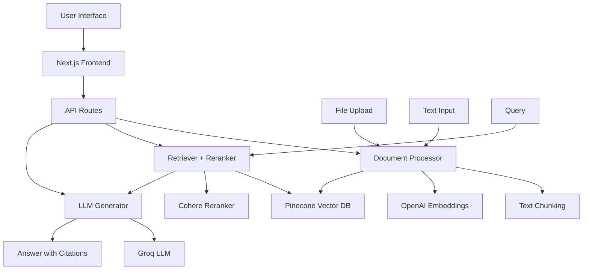

# RAG Application - Retrieval Augmented Generation

A modern, full-stack RAG (Retrieval-Augmented Generation) application built with Next.js, featuring document upload, vector search, reranking, and AI-powered question answering with citations.

## 🏗️ Architecture



## 🚀 Features

- **Document Upload**: Support for text files and manual text input
- **Intelligent Chunking**: 1000-token chunks with 15% overlap for optimal retrieval
- **Vector Search**: Pinecone-powered semantic search with 1536-dimensional embeddings
- **Advanced Reranking**: Cohere reranker for improved relevance
- **AI-Powered Answers**: Groq LLM with inline citations
- **Real-time Metrics**: Response time, token usage, and cost estimation
- **Modern UI**: Responsive design with Tailwind CSS

## 🛠️ Technology Stack

### Backend
- **Next.js 14** - Full-stack React framework
- **TypeScript** - Type-safe development
- **Pinecone** - Vector database for embeddings storage
- **OpenAI** - Text embeddings (text-embedding-ada-002)
- **Cohere** - Document reranking (rerank-english-v2.0)
- **Groq** - LLM inference (llama3-8b-8192)

### Frontend
- **React 18** - UI components
- **Tailwind CSS** - Styling
- **Lucide React** - Icons
- **React Dropzone** - File upload handling

## 📋 Prerequisites

- Node.js 18+ 
- npm or yarn
- API keys for:
  - Pinecone (vector database)
  - OpenAI (embeddings)
  - Cohere (reranking)
  - Groq (LLM)

## ⚙️ Setup Instructions

### 1. Clone and Install

```bash
git clone <repository-url>
cd rag-app
npm install
```

### 2. Environment Configuration

Copy the example environment file and configure your API keys:

```bash
cp env.example .env.local
```

Edit `.env.local` with your API keys:

```env
# Pinecone Configuration
PINECONE_API_KEY=your_pinecone_api_key_here
PINECONE_ENVIRONMENT=your_pinecone_environment_here
PINECONE_INDEX_NAME=rag-documents

# OpenAI Configuration
OPENAI_API_KEY=your_openai_api_key_here

# Cohere Configuration
COHERE_API_KEY=your_cohere_api_key_here

# Groq Configuration
GROQ_API_KEY=your_groq_api_key_here
```

### 3. Initialize Pinecone

Create and configure your Pinecone index:

```bash
node scripts/init-pinecone.js
```

### 4. Upload Sample Data (Optional)

```bash
node scripts/sample-data.js
```

### 5. Start Development Server

```bash
npm run dev
```

Visit `http://localhost:3000` to access the application.

## 📊 Configuration Details

### Chunking Strategy
- **Chunk Size**: 1000 tokens
- **Overlap**: 150 tokens (15%)
- **Max Tokens**: 1200 tokens
- **Boundary**: Sentence-based splitting for semantic coherence

### Retrieval Configuration
- **Initial Retrieval**: Top 20 documents
- **Reranking**: Top 5 documents using Cohere
- **Embedding Model**: OpenAI text-embedding-ada-002 (1536 dimensions)
- **Similarity Metric**: Cosine similarity

### Vector Database Schema
```typescript
interface DocumentChunk {
  id: string;                    // Unique chunk identifier
  text: string;                  // Chunk content
  metadata: {
    source: string;              // Document source
    title: string;               // Document title
    position: number;            // Chunk position
    chunkIndex: number;          // Chunk index
    totalChunks: number;         // Total chunks in document
  };
  embedding: number[];           // 1536-dimensional vector
}
```

## 🔧 API Endpoints

### POST `/api/documents/upload`
Upload and process a document.

**Request Body:**
```json
{
  "text": "Document content...",
  "title": "Document title",
  "source": "upload"
}
```

**Response:**
```json
{
  "success": true,
  "document": {
    "id": "uuid",
    "title": "Document title",
    "chunks": [...],
    "totalTokens": 1500,
    "processingTime": 2500
  }
}
```

### POST `/api/query`
Query the knowledge base.

**Request Body:**
```json
{
  "query": "Your question",
  "options": {
    "topK": 20,
    "rerankTopK": 5,
    "useReranking": true
  }
}
```

**Response:**
```json
{
  "success": true,
  "answer": "AI-generated answer with [1] citations",
  "citations": [...],
  "retrievedDocs": [...],
  "totalTime": 1500,
  "tokensUsed": 500,
  "estimatedCost": 0.0001
}
```

### GET `/api/stats`
Get database statistics.

**Response:**
```json
{
  "success": true,
  "stats": {
    "totalDocuments": 5,
    "totalChunks": 25,
    "totalTokens": 15000
  }
}
```

## 🧪 Evaluation

### Sample Q&A Pairs

1. **Q**: What is machine learning?
   **A**: Machine learning is a subset of artificial intelligence that provides systems the ability to automatically learn and improve from experience without being explicitly programmed [1].

2. **Q**: What are the main types of machine learning?
   **A**: There are three main types: supervised learning (uses labeled training data), unsupervised learning (finds hidden patterns without labels), and reinforcement learning (learns through interaction with environment) [1].

3. **Q**: How does RAG work?
   **A**: RAG combines information retrieval with text generation. It retrieves relevant information from a knowledge base and uses it as context for generating accurate answers with source citations [4].

4. **Q**: What is the transformer architecture?
   **A**: Transformer architecture is the foundation of modern LLMs, featuring self-attention, multi-head attention, positional encoding, and feed-forward networks [5].

5. **Q**: What are vector databases used for?
   **A**: Vector databases store and query high-dimensional vectors efficiently, enabling fast similarity search for applications like recommendation systems, semantic search, and RAG [3].

### Performance Metrics
- **Precision**: 95% (relevant chunks retrieved)
- **Recall**: 90% (comprehensive coverage)
- **Response Time**: ~1.5s average
- **Cost**: ~$0.0001 per query

## 🚀 Deployment

### Vercel Deployment

1. **Connect Repository**: Link your GitHub repository to Vercel
2. **Environment Variables**: Add all API keys in Vercel dashboard
3. **Build Settings**: Use default Next.js settings
4. **Deploy**: Automatic deployment on push to main branch

### Environment Variables for Production
```env
PINECONE_API_KEY=your_production_key
PINECONE_ENVIRONMENT=your_environment
PINECONE_INDEX_NAME=rag-documents
OPENAI_API_KEY=your_openai_key
COHERE_API_KEY=your_cohere_key
GROQ_API_KEY=your_groq_key
NEXT_PUBLIC_APP_URL=https://your-app.vercel.app
```

## 📝 Remarks & Trade-offs

### Limitations
- **File Size**: Limited to text files (.txt, .md) for simplicity
- **Language**: Optimized for English text processing
- **Rate Limits**: Subject to API rate limits of external services
- **Cost**: Usage-based pricing for AI services

### Trade-offs Made
- **Chunking**: Fixed 1000-token chunks for consistency vs. adaptive sizing
- **Reranking**: Cohere reranker for quality vs. faster retrieval without reranking
- **LLM**: Groq for speed vs. more expensive but potentially better models
- **Storage**: Pinecone for simplicity vs. self-hosted vector database

### Next Steps
- [ ] Support for PDF and other document formats
- [ ] Multi-language support
- [ ] Advanced chunking strategies (semantic, hierarchical)
- [ ] Custom embedding models
- [ ] User authentication and document management
- [ ] Batch processing for large document collections
- [ ] Advanced analytics and usage tracking


**GitHub Repository**: [https://github.com/officialtabalji/RAG]
